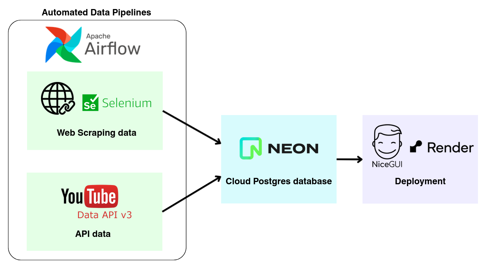

# Hololive Content Tracker
A website that shows upcoming streams and performance analytics for talents from Hololive Production with automatic updates for fans to monitor their latest content.

https://hololive-content-tracker.onrender.com/

This is an end-to-end data engineering project with automated data pipelines orchestrated by a self-hosted Apache Airflow instance, performing scheduled ETL that scrapes and loads data into a cloud PostgreSQL database, with the frontend served on Render. DAG definitions are available [here](https://github.com/JYNgithub/HLCT-Airflow-DAGs).

**What it does:**
1. Shows upcoming scheduled streams/content for each talent with thumbnails and details
2. Tracks livestream analytics (duration, views, likes, comments) from the past 7 days
3. Indicates which talents have upcoming content with a live indicator
4. Provides clickable links to YouTube streams and talent pages

**Key features:**
1. Scheduled updates: Automatically scrapes the official Hololive website to get the latest scheduled content
2. Analytics tracking: Uses YouTube API to gather performance data from recent livestreams
3. Structured architecture: Data collection is orchestrated via a self-hosted Apache Airflow instance, running scheduled DAG pipelines that handles ETL into a cloud PostgreSQL database

